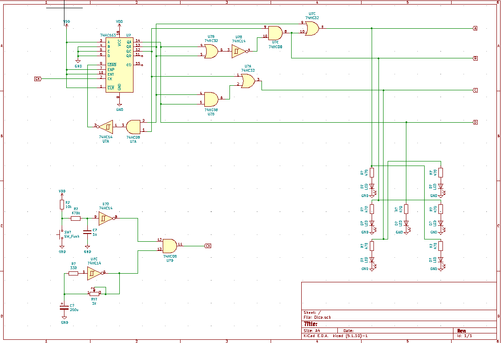

# 電子サイコロ

## 概要
ロジックICのみで作った電子サイコロです。パーツは家にあるものを使っているので，素子数などの最適化はされていません。

## 使い方（予定）

* タクトスイッチを押している間にサイコロの目をシャッフル
* 放すと一定時間たった後に止まる
* シャッフルの速度は可変抵抗で変更可能

## 仕組み
カウンタとデコード回路で構成されています。
サイコロの表示は以下の通りです。

```
    A ○      C' ○
    B ○  D ○ B' ○
    C ○      A' ○
```

AとA'，BとB'，CとC'は必ず同時に点灯するので，実質4つのLEDを制御することとなります。
光り方のパターンは以下のようになります。

| サイコロの目 | A   | B   | C   | D   | 
| ------------ | --- | --- | --- | --- | 
| 1            | 0   | 0   | 0   | 1   | 
| 2            | 1   | 0   | 0   | 0   | 
| 3            | 0   | 0   | 1   | 1   | 
| 4            | 1   | 0   | 1   | 0   | 
| 5            | 1   | 0   | 1   | 1   | 
| 6            | 1   | 1   | 1   | 0   | 

### カウンタ

* 74HC163(同期リセット4bitアップカウンタ)を使って，1→2→3→4→5→6→1→… となるようにカウントしています。

### デコーダ
カウンタの出力をサイコロの表示となるようにデコードします。
デコード表は以下の通りになります。並び替えることで，出来るだけカウンタの値をそのまま利用できるようにしています。

| カウンタの値 | サイコロの目 | B   | C   | A   | D   | 
| ------------ | ------------ | --- | --- | --- | --- | 
| 001          | 1            | 0   | 0   | 0   | 1   | 
| 010          | 2            | 0   | 0   | 1   | 0   | 
| 011          | 5            | 0   | 1   | 1   | 1   | 
| 100          | 6            | 1   | 1   | 1   | 0   | 
| 101          | 3            | 0   | 1   | 0   | 1   | 
| 110          | 4            | 0   | 1   | 1   | 0   | 


## 回路図
